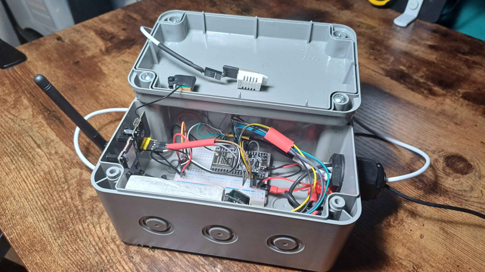
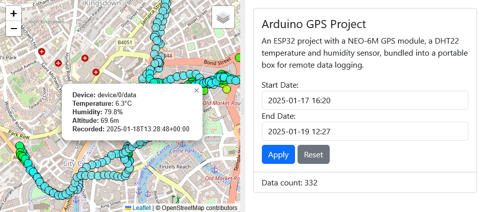
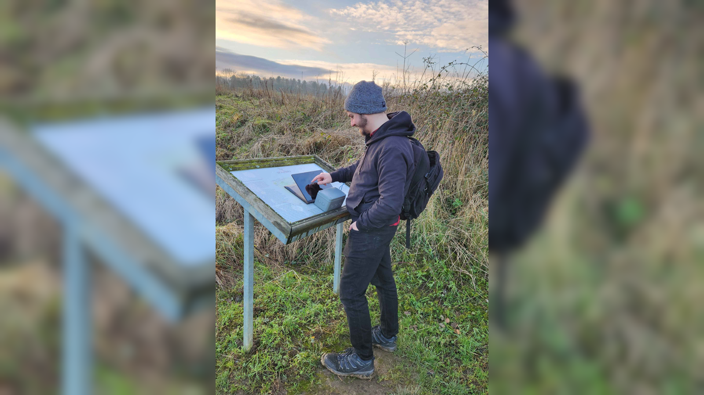
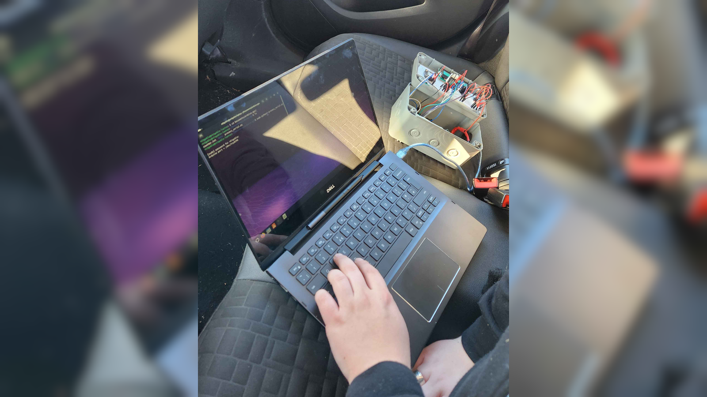

# Arduino GPS Project

This project is an ESP32-based GPS and sensor tracking system that logs location and environmental data, then visualises it on a Flask webserver with an interactive Leaflet map.

           

## Features

- **ESP32 hardware**
  - **NEO-6M GPS module**: Captures location data
  - **DHT22 sensor**: Measures temperature and humidity
  - **SD card module**: Stores data while offline, provides configuration options
  - **Portable Battery and Project case**: Designed for outdoor use and mobility
- **Backend**
  - **Python Flask webserver**: Serves the frontend and data endpoints
  - **PostgreSQL with PostGIS**: Stores location data and performs spatial queries
- **Frontend**
  - **Leaflet.js**: Displays location data on an interactive map
  - **Bootstrap**: Provides clean UI with rapid prototyping
  - **flatpickr**: Date picker for filtering data
  - **TypeScript, HTML, CSS**: Frontend languages built with Webpack

A project for me to learn a geospatial stack and build a full-stack application from scratch, bringing in my love for microcontrollers and IoT.

## Further information

- [Hardware](hardware/README.md): Details on the hardware components and how they are set up.
- [Webserver](webserver/README.md): Installation instructions for the webserver.

## Photos

||
|:--:|
| *The project in its box, DHT22 sensor on a long wire* |

||
|:--:|
| *The Flask webserver displaying the map and data* |

||
|:--:|
| *Out in the field collecting data and checking it is functioning correctly* |

||
|:--:|
| *Collecting data in my car, connected to laptop for debugging* |
