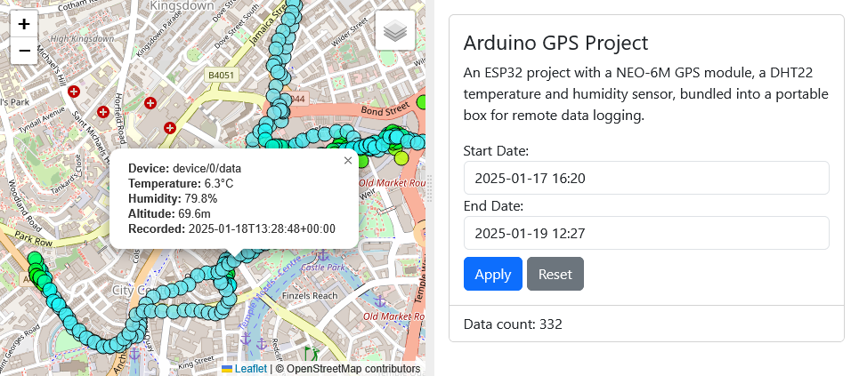

# Arduino GPS Project Webserver

Flask webserver used to display Postgres data from the hardware of the project. Uses Leaflet.js to display the data on a map. Bootstrap for styling.

Backend written in Python, frontend in TypeScript, HTML and CSS with Webpack.



## Table of Contents

- [Arduino GPS Project Webserver](#arduino-gps-project-webserver)
  - [Table of Contents](#table-of-contents)
  - [Install](#install)
  - [Build](#build)
  - [Run](#run)

## Install

Install the Node.js dependencies with npm. Then, create a virtual environment and install the Python dependencies.

```bash
npm install
python -m venv .venv
source .venv/bin/activate
pip install -r requirements.txt
```

## Build

Run once to build the frontend. This will create the compiled JavaScript in the `src/static/js` directory for Flask to serve.

```bash
npm run build
```

## Run

Run the Flask server to serve the webpages. This is in development mode, so it will reload the server when changes are made.

```bash
flask --app src/app.py run
```
